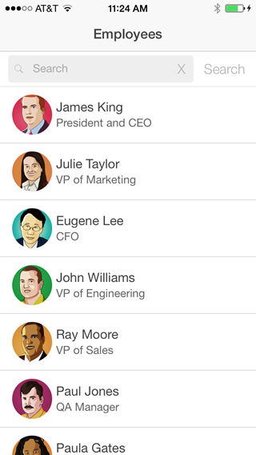

[](https://heroku.com/deploy)

# Employee Directory with React and Node123

Employee directory is a sample application that allows you to look up employees by Ashish, view the detailsss of an employee,
call, text, or email an employee, and navigate up and down the org chart.

This version of Employee Directory is built with [React](http://facebook.github.io/react/) and [Node.js]().




You can test the application in your browser:
- Using the hosted version
- By running the application's Node.js server locally
- By deploying the application's Node.js server on Heroku

You can also run the application as a hybrid app in Cordova.

## Hosted Version

Click [here](http://react-directory.herokuapp.com) to run the hosted version in your browser.

## Running the Node.js Server Locally

1. Make sure you have an up-to-date version of Node.js installed on your system. If you don't have Node.js installed, you can install it from [here](http://nodejs.org/).

1. Clone this repository

1. On the command line, navigate (cd) to the **directory-react-nodejs** folder

1. Install the server dependencies

  ```
  npm install
  ```

1. Start the server

  ```
  node server
  ```

1. Open a browser and access: [http://localhost:5000](http://localhost:5000)


## Deploying the Node.js Server to Heroku

Click the "Deploy to Heroku" button at the top of this page to deploy the application to your own Heroku instance.


## Running in Cordova

### Step 1: Install Cordova

1. Make sure you have an up-to-date version of Node.js installed on your system. If you don't have Node.js installed, you can install it from [here](http://nodejs.org/).

1. Open a terminal window (Mac) or a command window (Windows), and install Cordova:

  ```
  npm install -g cordova
  ```

  On a Mac, you may have to use **sudo** depending on your system configuration:

  ```
  sudo npm install -g cordova
  ```

1. If you already have Cordova installed on your computer, make sure you update to the latest version:

  ```
  npm update -g cordova
  ```

  or

  ```
  sudo npm update -g cordova
  ```

### Step 2: Create the application

1. Using the Cordova CLI, create an application named **employee-directory**:

  ```
  cordova create react-directory
  ```

1. Delete the default ***www*** folder in the ***react-directory*** folder that was just created

1. Copy the ***www*** folder from this repository to the Cordova project's ***employee-directory*** folder

1. Add cordova.js as the first script in index.html

    ```
    <script src="cordova.js"></script>
    ```

    > codova.js doesn't need to be in your www folder. It is automatically injected by the Cordova CLI during the build process


1. Modify ***www/js/data-service.js*** and set the baseURL variable to the URL where your Node.js server is running. For example:

    ```
    var baseURL = 'http://reactjs-directory.herokuapp.com';
    ```


### Step 3: Building for iOS

> You need the iOS SDK installed on your computer to build an iOS version of your application
using the steps below.

1. On the command line, make sure you are in the **react-directory** folder

1. Add support for the iOS platform:

    ```
    cordova platforms add ios
    ```

1. Build the project:

    ```
    cordova build ios
    ```

1. Open **react-directory.xcodeproj** in the **ract-directory/platforms/ios** folder

1. In Xcode, run the application on a device connected to your computer or in the iOS emulator


### Step 4: Building for Android

> You need the Android SDK installed on your computer to build an Android version of your
application using the steps below.

1. Make sure the Android SDK and the ant build tool are available on your system. The Android SDK is available [here](http://developer.android.com/sdk/index.html). **Both the android and ant tools must be available in your path**. To test your configuration, you should be able to execute both **android** and **ant** from the command line.

1. On the command line, make sure you are in the **react-directory** folder

1. Add support for the Android platform:

    ```
    cordova platforms add android
    ```

1. Build the project:

    ```
    cordova build android
    ```

    The project is built in the **react-directory/platforms/android** folder


1. To build and run the application on an Android device connected to your computer using a USB cable:

    ```
    cordova run android
    ```

1. To build and run the application in the Android emulator:

    ```
    cordova emulate android
    ```
